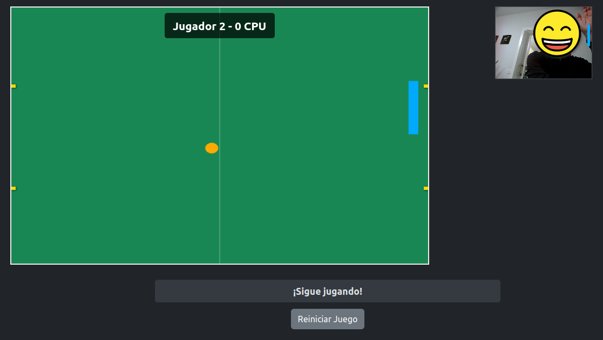

# 🎮 Mediapipe Hand Pong

[](https://opensource.org/licenses/MIT) [](https://soyunomas.github.io/mediapipe-hand-pong/index.html) <!-- Asegúrate que el archivo principal se llame index.html -->

Un juego interactivo tipo Pong controlado por gestos de la mano utilizando la cámara web y MediaPipe Pose. 🖐️↔️🎾

## 📝 Descripción Breve

Este proyecto es un juego web simple inspirado en Pong, donde controlas la pala derecha moviendo tu mano derecha frente a la cámara web. Utiliza la biblioteca MediaPipe Pose de Google para detectar la posición de tu mano en tiempo real y mover la pala correspondiente en el juego. El objetivo es marcar goles en la portería izquierda mientras evitas que la pelota entre en tu portería derecha.

## 🖼️ Captura de Pantalla / Demo



Puedes probar la demo en vivo aquí:

*   **[Demo - Jugar Ahora](https://soyunomas.github.io/mediapipe-hand-pong/index.html)**
    
## ✨ Características Principales

*   **🖐️ Control por Gestos:** Mueve la pala derecha usando tu mano derecha, detectada vía webcam.
*   **🤖 Integración MediaPipe:** Utiliza Google MediaPipe Pose para el seguimiento de la mano en tiempo real.
*   **🕹️ Jugabilidad Pong Clásica:** Rebota la pelota y marca goles en la portería contraria.
*   **📈 Dificultad Progresiva:** La velocidad de la pelota aumenta cada 2 segundos.
*   **🏆 Sistema de Puntuación:** Partida al mejor de 10 goles (Jugador vs CPU implícito).
*   **👁️ Vista Previa Webcam:** Muestra una pequeña ventana con la imagen de la cámara y la pala virtual superpuesta (útil para posicionarse).
*   **📱 Diseño Responsivo:** El layout se adapta, moviendo la vista previa de la webcam debajo del juego en pantallas pequeñas (Bootstrap 5).
*   **🎨 Tema Oscuro y Estilo:** Interfaz moderna basada en Bootstrap 5 modo oscuro, con fondo de "césped" verde.
*   **🧩 Código Autónomo:** Desarrollado principalmente en un único archivo HTML con CSS y JavaScript (requiere servidor local para ejecutarse debido a las dependencias y `getUserMedia`).

## 🛠️ Tecnologías Utilizadas

*   **HTML5:** Estructura semántica del contenido.
*   **CSS3:** Estilos personalizados para el juego, layout y tema oscuro.
*   **Bootstrap 5.3.x:** Framework CSS/JS para layout responsivo y componentes básicos.
*   **JavaScript (ES6+):** Lógica del juego (movimiento, colisiones, puntuación), interacción con MediaPipe, manipulación del DOM.
*   **MediaPipe Pose:** Librería de Google para la detección de pose corporal (específicamente la muñeca) desde la cámara web.
*   **MediaPipe Camera Utils:** Utilidades para manejar el stream de la cámara con MediaPipe.
*   **CDNs:** Bootstrap y MediaPipe se cargan desde CDNs.

## 🚀 Instalación / Visualización Local

**IMPORTANTE:** Debido a las restricciones de seguridad del navegador (`CORS`, `file://`) y la necesidad de acceder a la cámara (`getUserMedia`), este proyecto **NO funcionará correctamente si abres el archivo HTML directamente desde tu sistema de archivos**. Necesitas servirlo a través de un servidor web local (HTTP/HTTPS).

1.  **Clona el repositorio:**
    ```bash
    git clone https://github.com/soyunomas/mediapipe-hand-pong.git
    ```
2.  **Navega al directorio del proyecto:**
    ```bash
    cd mediapipe-hand-pong
    ```
3.  **Inicia un servidor web local:** Elige UNA de las siguientes opciones:
    *   **Usando Python 3:**
        ```bash
        python -m http.server 8000
        ```
        (O `python3 ...` si tienes ambas versiones). Luego abre `http://localhost:8000/` en tu navegador (o el nombre específico de tu archivo HTML, ej. `http://localhost:8000/index.html`).
    *   **Usando Node.js (con `npx`):**
        ```bash
        npx serve
        ```
        Esto iniciará un servidor y te dará una URL local (ej. `http://localhost:3000`). Abre esa URL.
    *   **Usando la extensión "Live Server" en VS Code:** Haz clic derecho en el archivo HTML y selecciona "Open with Live Server".
4.  **Permisos de Cámara:** Asegúrate de conceder permiso a tu navegador para acceder a la cámara web cuando te lo solicite.
5.  **🌐 Conexión a Internet:** Es necesaria para cargar Bootstrap y MediaPipe desde sus CDNs.

## 🕹️ Cómo Jugar

1.  **Abre el Juego:** Carga la página a través de tu servidor local.
2.  **Permite la Cámara:** Autoriza el acceso a tu cámara web cuando el navegador lo pida.
3.  **Posiciónate:** Coloca tu mano derecha visiblemente en el área de captura de la webcam. Puedes usar la pequeña ventana de vista previa (arriba a la derecha en escritorio, abajo en móvil) para verificar.
4.  **Controla la Pala:** Mueve tu mano derecha hacia arriba y hacia abajo para controlar la pala azul en el lado derecho del campo de juego.
5.  **Juega:** Intenta golpear la pelota naranja para que entre en la portería del lado izquierdo. Evita que la pelota entre en tu portería derecha.
6.  **Marca Goles:** El primer jugador (tú o la CPU implícita) que llegue a 10 goles gana la partida.
7.  **Reinicia:** Haz clic en el botón "Reiniciar Juego" para empezar una nueva partida en cualquier momento.

## 📄 Licencia

Este proyecto está bajo la Licencia MIT.
[](https://opensource.org/licenses/MIT)

## 🧑‍💻 Contacto

Creado por **soyunomas** ([@soyunomas en GitHub](https://github.com/soyunomas))

---
